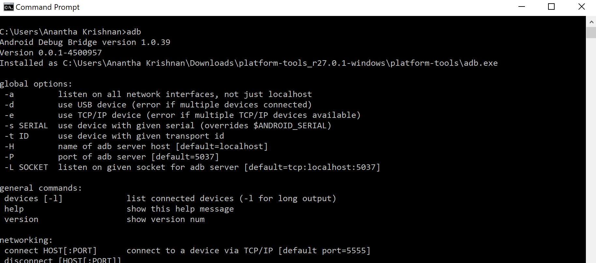

# Responsive Design Framework

Automation framework which provides flexibility to run a test against any screen resolution, emulators or real devices

Utilizes both Selenium and Appium driver to provide different flavors to the test

[]

## Getting Started

Clone the repository

```
git clone https://github.com/AKat47/ResponsiveDesignAutomationFramework.git
```

### Prerequisites

1).Net Framework (4.5 & above)

2) All Browsers installed (IE11, Edge, Chrome, Firefox)

3) Android devices (with developer mode enabled)

4) Appium Server

```
https://github.com/appium/appium-desktop
```

Install Android SDK Tools

```
https://developer.android.com/studio/releases/platform-tools
```

Extract the file and make sure to add it to environment PATH

### Installation

Verify all tools are working fine

Android SDK Tools

```
Open CMD and type adb

```

[]

Connect device using USB to the system under test and ensure RSA Encryption is accepted

[IMAGE]

## Running the tests

1. Open the CMD prompt
2. Traverse to the Automation folder
3. Trigger the Execution

```
dotnet test

```


### What are the tests

There are three types of smoke test to ilustrate the flexibility of the framework

The execution of the test is based on the parameters passed in DataRow property

#### Cross Browser Testing

```
[DataTestMethod]
[DataRow(BrowserName.Chrome)]
public void AddCart_OnBrowsers(string browserName)

Runs on browser mode with full resolution (using Selenium)
```


#### Emulator Testing

```
[DataTestMethod]
[DataRow(BrowserName.Chrome,"iPhone 6",false)]
public void AddCart_OnEmulators(string browserName,string deviceName,bool realDevice)

Runs on browser mode with full resolution (using chrome mobile emulation + Selenium)
```

#### Real Device Testing

```
[DataTestMethod]
[DataRow(BrowserName.Chrome, "HT71S1632212", true)]
public void AddCart_OnRealDevices(string browserName, string deviceName, bool realDevice)

Runs on specified browser on a real device(using Appium)
```

## Flexibility

1. The framework can be extended to run applitools to perform visual regression testing for the application on different screen sizes & devices
2. The framework could also be extended to run the test against the Selenium grid
3. External reports can be integrated to provide a more detailed output of test result against different parameters passed in the test
(Sample report is placed in Reports folder)

##Future ToDo

1. Minimize the wrappers for drivers by combining both appium and selenium under one 
2. Enable parallel run to get faster feedback
3. Applitools integration


## Built With

* C#
* [Selenium Webdriver](https://www.seleniumhq.org/projects/webdriver/) - To interact with browsers on system
* [Appium](http://appium.io/) - To interact with browsers/Native APP on mobile


## Authors

* **Anantha Krishnan** - *Initial work* - [AKat47](https://github.com/AKat47)

## License

This project is licensed under the MIT License - see the [LICENSE.md](LICENSE.md) file for details

## Acknowledgments

* Inspiration from Open Source Community!!


